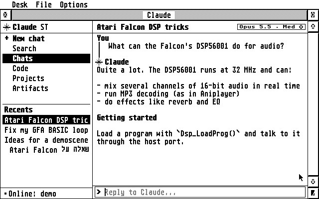

# Claude ST


A Claude.ai client for the Atari ST, STE, Mega ST/STE, TT and Falcon,
running as a native GEM application.



The window works like claude.ai. The sidebar on the left has **New chat**,
**Search**, **Chats**, **Projects** and **Artifacts**, followed by your
recent conversations. The open conversation fills the right side, with
the reply line at the bottom. Replies stream in as Claude writes them.


## How it works

```
 Atari ST / Falcon                         Raspberry Pi (or any computer)
┌──────────────────┐  WiFi/LAN via STinG  ┌────────────────────┐   HTTPS   ┌───────────┐
│ CLAUDE.PRG (GEM) │ ◄──────────────────► │  claude_bridge.py  │ ◄───────► │ claude.ai │
└──────────────────┘  or a serial cable   └────────────────────┘           └───────────┘
```

An 8 MHz 68000 can't do modern TLS, so a small Python **bridge** on a
modern computer handles HTTPS. The Atari reaches the bridge over the
network through **STinG** (no cable at all) or over the serial port.
They exchange simple text lines (see [PROTOCOL.md](PROTOCOL.md)). The
bridge converts between Unicode and the Atari character set and turns
Markdown into something a monochrome 80-column screen can show. The
Atari does all the drawing and word wrapping itself.

The Atari program is about 21 KB. It's written in freestanding C with
its own small AES/VDI/STinG bindings, so it doesn't need MiNTLib or a
resource file. It runs on plain TOS 1.0 through 4.x, EmuTOS and MiNT, in
any resolution of at least 640×200: ST high, ST medium, TT and Falcon
modes.

## Installing

The setup for your machines (Atari at 192.168.68.129, Pi at
192.168.68.126) is fully wireless. Give both a fixed address (a DHCP
reservation in your router) so they keep these IPs.

### 1. The Pi: install the gateway

The Pi runs the bridge permanently, so you never start anything by hand.
It can share a Pi you already use for other jobs: the installer adds
only its own user, `/opt/claude-st`, `/etc/claude-st` and one service
called `claude-st`.

```sh
ssh pi@192.168.68.126
git clone https://github.com/whomper/Atari_claude.git   # private repo: sign in with a GitHub token
cd Atari_claude/pi
sudo ./install.sh --network --atari 192.168.68.129   # asks for your claude.ai sessionKey (hidden)
```

The Pi now listens on TCP port 2323 and accepts connections **only from
192.168.68.129**. If `ufw` is enabled, the installer opens the port for
that address. The service starts at every boot. If claude.ai is
unreachable or the session key has expired, the error appears in the
Claude ST window, so you can see what's wrong from the Atari.

How to get the session key is described under
[the claude.ai backend](#3b-or-on-any-computer-the-bridge-by-hand) below.

| Task | Command on the Pi |
|------|-------------------|
| See whether it's running | `systemctl status claude-st` |
| Watch the log | `journalctl -u claude-st -f` |
| New session key (when claude.ai logs you out) | `sudo ./install.sh --set-key` |
| Use the Anthropic API instead | `sudo ./install.sh --backend api` |
| Try the demo backend | `sudo ./install.sh --backend demo` |
| Change the Atari's address | `sudo ./install.sh --atari 192.168.68.130` |
| Switch to a serial cable | `sudo ./install.sh --port auto` |
| Update after a `git pull` | `sudo ./install.sh` |
| Remove | `sudo ./install.sh --uninstall` |

Settings are stored in `/etc/claude-st/claude-st.env`, readable only by
root and the service. The session key lives there, not in the
repository.

### 2. The Atari

1. Make sure **STinG** is loaded and the network works, for example by
   pinging the Pi from STinG's tools.
2. Copy `st/CLAUDE.PRG` **and** `st/CLAUDE.INF` into the same folder.
   `CLAUDE.INF` holds the gateway address:
   ```
   tcp 192.168.68.126 2323
   ```
3. Double-click `CLAUDE.PRG`. The status line at the bottom left shows
   *Connecting to 192.168.68.126*, then *Online*.

To point Claude ST at a different gateway, type
`/connect 192.168.68.126` (or `/connect host:port`) in the reply line.
It's saved to `CLAUDE.INF`. **Options ▸ Network (STinG)** and **Options ▸
Serial port** switch between the two links. If the Pi restarts or the
WiFi drops, Claude ST reconnects by itself.

Claude ST needs about 250 KB of free RAM, and works with less by keeping
a shorter scrollback.

### Alternative: a serial cable

If you don't have STinG, use the serial link instead. Delete
`CLAUDE.INF` (or choose **Options ▸ Serial port**) and install the Pi
with `sudo ./install.sh --port auto`.

| Machine | Port |
|---------|------|
| ST, STE, Mega ST/STE | the 25-pin **Modem** (RS-232) port |
| TT | **Modem 1** |
| Falcon 030 | the 9-pin **Modem** port |

Use a null-modem cable and a **USB-to-RS-232 adapter** on the Pi. Don't
wire the Atari straight to the Pi's GPIO pins: the Atari's port uses
±12 V RS-232 signals, and they will damage the Pi. If you want to use
the GPIO UART instead, put a MAX3232 level-shifter board in between,
turn off the serial console in `raspi-config`, and use
`--port /dev/serial0`. The default speed is 19200 baud, 8N1. You can
change it under **Options**; give the Pi the same `--baud`.

A **WiFi modem** on the serial port also works, if it runs in
transparent TCP mode. Point it at `pi-address:2323`, keep Claude ST on
the serial link, and install the Pi with
`--network --atari <the modem's IP>`.

### 3b. Or on any computer: the bridge by hand

```sh
cd bridge
pip install -r requirements.txt
```

There are three backends.

**Your claude.ai account** (the default). You get your real chats,
projects and artifacts, and new chats appear on claude.ai too.

1. Log in to claude.ai in a desktop browser.
2. Open the developer tools: *Application* (Chrome) or *Storage*
   (Firefox) → *Cookies* → `https://claude.ai`.
3. Copy the value of the `sessionKey` cookie. It starts with
   `sk-ant-sid`.

```sh
export CLAUDE_SESSION_KEY='sk-ant-sid01-...'
python3 claude_bridge.py --serial /dev/ttyUSB0          # Linux
python3 claude_bridge.py --serial /dev/tty.usbserial-X  # macOS
python3 claude_bridge.py --serial COM3                  # Windows
```

> **Heads-up.** claude.ai has no public API for personal accounts. This
> backend uses the same private endpoints as the claude.ai website, so it
> can stop working whenever claude.ai changes. The session key gives
> full access to your account, so keep it private and never commit it.
> If requests are blocked (HTTP 403), install `curl_cffi`, which is in
> `requirements.txt`. The bridge uses it automatically.

**The Anthropic API.** This backend is official and stable, but chats
are stored on your computer, not in your claude.ai account. It uses
`claude-opus-5-5` by default (change it with `--model`), with
server-side refusal fallbacks turned on.

```sh
export ANTHROPIC_API_KEY=sk-ant-api...
python3 claude_bridge.py --backend api --serial /dev/ttyUSB0
```

History is stored in `~/.claude-st/chats/`. To add projects, create
`~/.claude-st/projects.json`:

```json
[{"id": "retro", "name": "Retro coding", "instructions": "Answer as a 68000 expert."}]
```

**Demo.** Uses built-in sample chats and canned replies, with no
network. Use it to check the cable and the Atari side:

```sh
python3 claude_bridge.py --backend demo --serial /dev/ttyUSB0
```

## Using Claude ST

| Action | Mouse | Keyboard |
|--------|-------|----------|
| New chat | **+ New chat** | `F1` / `Ctrl+N` |
| Recent chats | **Chats** | `F2` |
| Projects | **Projects** | `F3` |
| Artifacts | **Artifacts** | `F4` |
| Search chat titles | **Search** | `F5` / `Ctrl+F` |
| Open a sidebar item | click it | `Tab` / `Shift+Tab` to pick, then `Return` |
| Item menu: Open, Pin, Rename, Move to project, Archive, Delete | **right-click** the chat or project | `Tab` to pick it, then `Insert`; arrows + `Return` in the menu, `Esc` closes |
| Resize the sidebar | drag the divider line (the pointer turns into a hand) | — |
| Page through the sidebar list | the ↑ ↓ arrows next to the list title | — |
| Send a message | — | type, then `Return` |
| Scroll the conversation | scroll bar, or click the upper/lower half | `↑` `↓`, `Shift+↑/↓` by page, `Clr/Home` top, `Shift+Clr/Home` bottom |
| Type in Hebrew (on/off) | Options ▸ Hebrew keys | `F10` |
| Edit the reply line or a dialog field | — | `←` `→` move, `Shift+←/→` start/end, `Ctrl+←/→` by word, `Backspace`/`Delete` |
| Clear the input | — | `Esc` / `Undo` |
| Reconnect to the bridge | File ▸ Reconnect | `Ctrl+R` |
| Set the gateway address | Options ▸ Network (STinG) | type `/connect 192.168.68.126` |
| Use the serial cable instead | Options ▸ Serial port | type `/serial` |
| About | Desk ▸ About | `Help` |
| Quit | close box / File ▸ Quit | `Ctrl+Q` |

Right-click a chat for **Open, Pin/Unpin, Rename…, Move to project…,
Delete…**, or a project for **Open, Pin/Unpin, Rename…, Archive,
Delete…**. The item the menu applies to is highlighted before the menu opens, and
stays highlighted while the menu, a confirmation or a rename is in
progress. The open chat is outlined meanwhile, so the two can't be
confused. The menu opens just below the item, or above it near the
bottom of the list. Pinned items move to the top of the list and show a
small diamond. Rename opens a small dialog with the current name in a text field:
edit it anywhere (the arrow keys move the cursor) and press `Return` or
click **Rename**, or press `Esc`/`Undo` or
click **Cancel**. `Clr/Home` clears the field and `F10` switches it to
Hebrew typing. Delete always asks first. The
sidebar width you drag to is remembered in `CLAUDE.INF`.

On claude.ai, these actions use the same private endpoints as the
website, like the rest of the claude.ai backend. If one stops working,
the Atari shows claude.ai's error in the chat pane. With `--backend api`
they act on the chats and projects stored on the Pi.

**Hebrew** and other right-to-left text is laid out by Claude ST itself,
because TOS has no bidirectional text support. A paragraph whose first
letter is Hebrew is right-aligned and reads right to left. English words
and numbers inside it keep their left-to-right order, and Hebrew phrases
inside English text are reversed in place. Brackets are mirrored. The
same applies to chat titles in the sidebar and title bar, and to the
reply line when you type Hebrew. The bridge sends the Atari's Hebrew
letters, drops vowel points (niqqud) and invisible direction marks, and
turns maqaf, geresh and gershayim into `-`, `'` and `"`. The Atari font
only has the plain letters.

**Typing Hebrew.** TOS has no Hebrew keyboard layout, so Claude ST has
its own: press `F10` (or choose **Options ▸ Hebrew keys**) and the
letter keys type Hebrew in the Israeli SI-1452 layout. `T` gives א, `A`
gives ש, `,` gives ת, `.` gives ץ, `/` gives a full stop, and `Q`/`W`
give `/` and `'`. An **HE** badge shows in the reply box while it's on.
Shift still types English capitals, and keys are mapped by position, so
any national Atari keyboard works. The setting is saved in `CLAUDE.INF`.

Switching area (**Search**, **Chats**, **Projects**, **Artifacts**, or
opening a project) clears the conversation pane and shows a hint for that
area, so nothing on screen belongs to the previous chat. What you type
next starts a new chat. After you open a project, the new chat is
created inside it.

Projects open as a list of their chats. A new chat started while a
project is open is created in that project. On claude.ai, artifacts are
stored inside conversations, so **Artifacts** lists the ones in your 15
most recent chats. Opening one shows its source.

## About box and icon

**Desk ▸ About Claude ST…** (or the `Help` key) shows the About box:


On a screen with 16 colours or more (Falcon and TT colour modes), the
About box shows a colour version of the icon: a putty-beige case like a
real Atari monitor, a dark CRT screen, the spark in a warm terracotta and
the prompt in green phosphor. Elsewhere it shows the black-and-white one.


The icon is 32×32 one-bit pixel art: the silhouette of the ST's SM124
monochrome monitor, with a simple eight-ray spark and a GEM-style
prompt on its dark screen. It's original artwork, not either company's
logo. `tools/icon/make_icon.py` draws both versions and writes `st/icon.h`
and `st/icon16.h` (built into the program), `docs/icon.png`,
`docs/icon16.png`, and `st/CLAUDE.ICN`, a standard ICN
file you can load into an icon editor to give `CLAUDE.PRG` its own icon
on the desktop.

## Settings (CLAUDE.INF)

Claude ST saves its settings to `CLAUDE.INF`, next to `CLAUDE.PRG`, as
soon as you change them. You can also edit the file in any text editor:

| Line | Set by |
|------|--------|
| `tcp 192.168.68.126 2323` or `serial` | `/connect`, `/serial`, Options ▸ Network / Serial port |
| `baud 19200` (or 9600, 4800) | Options ▸ baud rate |
| `sidebar 240` | dragging the divider (width in pixels) |
| `keyboard hebrew` | F10 / Options ▸ Hebrew keys |

The window's size and position, and the chat that was open, aren't
saved: Claude ST always opens full-screen with a new chat.

## Building

You need any m68k GCC. A stock Debian/Ubuntu cross compiler works:

```sh
sudo apt install gcc-m68k-linux-gnu
cd st && make          # -> CLAUDE.PRG
```

The program is freestanding, with its own startup code, traps and libgcc
helpers. `tools/elf2tos.py` turns the ELF into a relocatable TOS program.
An `m68k-atari-mint` toolchain also works: `make CROSS=m68k-atari-mint-`.

## Trying it in Hatari

To run Claude ST in the [Hatari](https://hatari.tuxfamily.org/) emulator on
your own Mac or Linux computer:

```sh
git clone https://github.com/whomper/Atari_claude.git && cd Atari_claude
tools/hatari-test.sh                 # demo chats, no account needed
```

The script copies `CLAUDE.PRG` to an emulated hard disk and downloads
EmuTOS (a free TOS) the first time. It starts the bridge, then boots
Hatari straight into Claude ST, with the emulated serial port wired to
the bridge through two named pipes. To use your real claude.ai account:

```sh
pip install -r bridge/requirements.txt
export CLAUDE_SESSION_KEY='sk-ant-sid01-...'
tools/hatari-test.sh claudeai
```

`MACHINE=ste tools/hatari-test.sh` runs an STE in colour, and
`TOS=/path/to/tos.img` uses your own TOS image. Quitting Hatari stops the
bridge too. The script uses the serial link because Hatari can't emulate
a network card. It also works only on an ST, STE or TT: Hatari doesn't
connect the Falcon's serial port to the pipes.

## Testing without hardware

The bridge has offline tests:

```sh
cd bridge && python3 -m unittest -v
```

The screenshots above come from [Hatari](https://hatari.tuxfamily.org/)
running EmuTOS, with the emulated serial port connected to the bridge
through FIFOs:

```sh
python3 bridge/claude_bridge.py --backend demo --pipe st_out st_in &
hatari --machine st --mono --harddrive st/ --auto 'C:\CLAUDE.PRG' \
       --rs232-out st_out --rs232-in st_in
```

Hatari only connects the ST's MFP serial port this way, so use an ST,
STE or TT machine type. On a real Falcon, the Modem port works normally.

Hatari has no network card, so the STinG code path is tested with
`tools/fakesting/FAKESTNG.PRG`. It's a stand-in for STinG: put it in the
emulated drive's `AUTO` folder, and it installs a `STiK` cookie and a
TCP/IP table whose one "connection" is tunnelled over the emulated serial
port. Claude ST then runs exactly as it would on STinG, reading
`CLAUDE.INF`, opening TCP to the gateway, and sending and receiving
through the STinG API. The bridge log shows
`DBG OPEN 192.168.68.126 2323`. For a serial-only test, leave
`CLAUDE.INF` out of the emulated drive. The fake driver is for testing
only; never install it on a real Atari.

## Files

```
Atari_claude/
├── st/                 the Atari program (C, GEM)
│   ├── claude.c        UI, word wrap, protocol
│   ├── gem.c / gem.h   minimal AES + VDI bindings
│   ├── sting.c / .S    STinG TCP client (Pure C calling convention shim)
│   ├── bidi.c          right-to-left (Hebrew) layout; `make test` runs bidi_test.c
│   ├── icon.h          the app icon (generated by tools/icon/make_icon.py)
│   ├── CLAUDE.INF      gateway address (tcp 192.168.68.126 2323)
│   ├── tos.c / tos.h   GEMDOS/BIOS/XBIOS traps, mini libc, 68000 libgcc helpers
│   ├── crt0.S          TOS startup
│   ├── link.ld         flat text/data/bss layout
│   └── CLAUDE.PRG      prebuilt binary
├── bridge/
│   ├── claude_bridge.py  serial / TCP / FIFO links + protocol
│   ├── backends.py       claude.ai, Anthropic API and demo backends
│   ├── atari_text.py     Atari charset + streaming Markdown formatter
│   └── test_bridge.py
├── pi/
│   ├── install.sh      Raspberry Pi gateway installer
│   └── claude-st.service
├── tools/
│   ├── hatari-test.sh  run Claude ST in Hatari with a local bridge
│   ├── elf2tos.py      ELF → TOS .PRG converter
│   └── fakesting/      STinG stand-in for testing in an emulator
└── PROTOCOL.md
```
