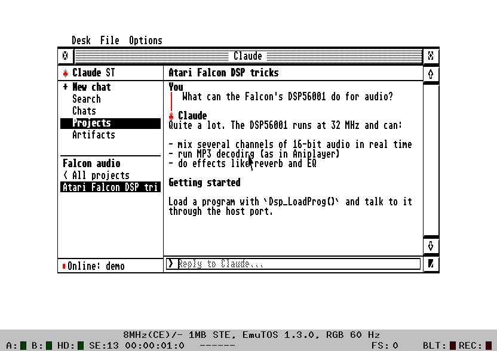
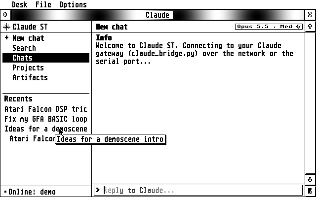
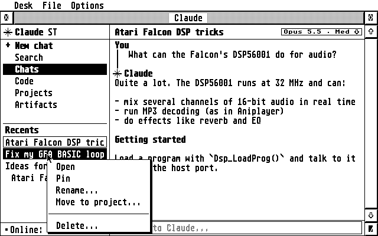
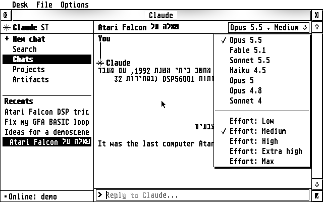
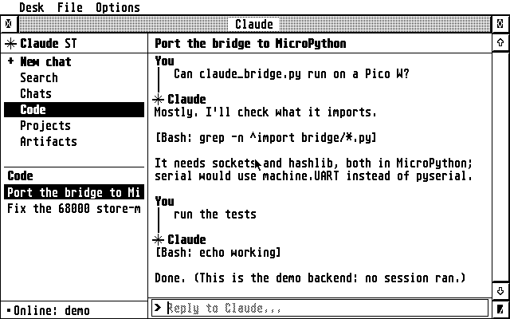
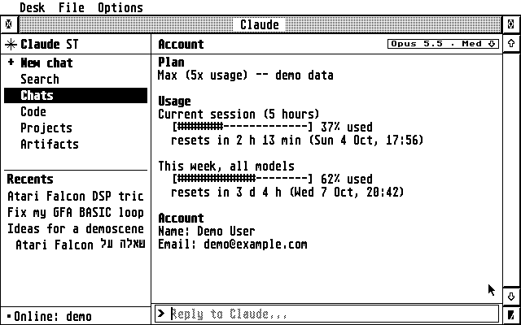
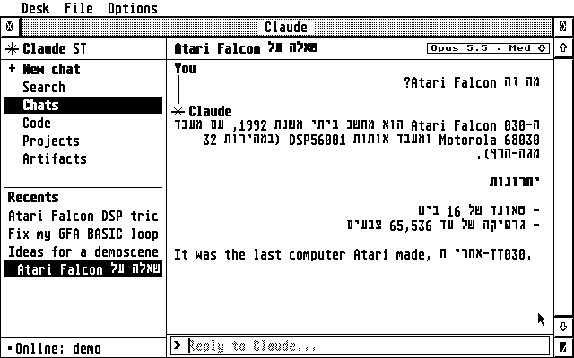
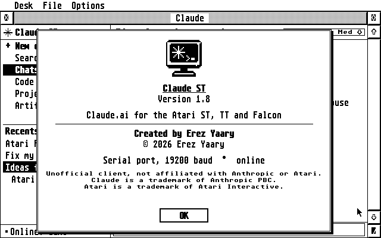
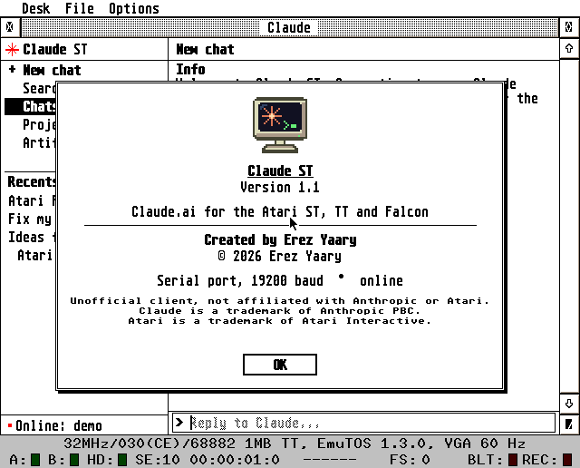

# Claude ST user guide

The [README](../README.md) covers setup. This guide describes each part
of Claude ST, then troubleshooting, settings and building. The
screenshots use the bridge's demo backend, so they show sample chats.

- [The window](#the-window)
- [Chats, projects and search](#chats-projects-and-search)
- [Right-click menus](#right-click-menus)
- [Model and effort](#model-and-effort)
- [Code: Claude Code sessions](#code-claude-code-sessions)
- [Artifacts](#artifacts)
- [Account, plan and usage](#account-plan-and-usage)
- [Hebrew](#hebrew)
- [All keys](#all-keys)
- [Settings (CLAUDE.INF)](#settings-claudeinf)
- [What is stored where](#what-is-stored-where)
- [Troubleshooting](#troubleshooting)
- [The bridge on another computer](#the-bridge-on-another-computer)
- [Serial cables and ports](#serial-cables-and-ports)
- [Icons](#icons)
- [Building](#building)

## The window

The sidebar on the left has **+ New chat**, **Search**, **Chats**,
**Code**, **Projects** and **Artifacts**, then the list for the chosen
area. The open conversation fills the right side, with the reply line at
the bottom. Drag the divider between them to resize the sidebar; the
pointer turns into a hand over it.



- **Status line** (bottom left): only the connection, such as
  *Connecting…*, *Online: claude.ai* or *Offline: …*.
- **Notices:** short messages such as *Loading chat...* or *Renamed*
  appear in grey at the right of the title bar for a few seconds.
- **Tooltips:** rest the mouse on a name that's cut off, in the sidebar
  or the title bar, and a tooltip shows all of it.



- **Switching area** empties the list at once, showing *Loading...* or
  the bridge's progress until the new list arrives. It also clears the
  conversation pane, so what you type next starts a new chat.
- **Scrolling:** the scroll bar, `↑` `↓`, `Shift+↑/↓` by page, and
  `Clr/Home` / `Shift+Clr/Home` for the top and bottom.

## Chats, projects and search

- **Chats** lists your recent chats. Pinned (starred) chats come first
  and show a small diamond.
- **Projects** lists your projects. Opening one lists its chats, with
  **< All projects** at the top. A new chat started there is created in
  that project.
- **Search** (`F5`) empties the list and turns the reply line into
  *Find:*. Type words from a chat's title and press `Return`.

A long conversation shows its last 40 messages.

## Right-click menus

Right-click an item, or pick it with `Tab` and press `Insert`. The item
is highlighted while its menu is open.

| Item | Menu |
|------|------|
| Chat | Open, Pin/Unpin, Rename…, Move to project…, Delete… |
| Project | Open, Pin/Unpin, Rename…, Archive, Delete… |
| Code session | Open, Rename…, Archive |
| Artifact | Open, Save to disk… |



**Rename…** opens a dialog with the current name: edit it and press
`Return`, or `Esc` to cancel. **Delete…** always asks first. In menus,
the arrow keys and `Return` work too, and `Esc` closes them.

## Model and effort

The chip at the right of the title bar shows the open chat's model and
effort, such as **Opus 5.5 · Med**. Click it, or press `F9`, for the
menu: the models, then the effort levels that model supports.



- **Models offered:** Opus 5.5, Fable 5.1, Sonnet 5.5, Haiku 4.5, Opus 5
  and Opus 4.8. A chat on an older model, such as Sonnet 4, adds that
  model to the menu.
- **Effort:** Low, Medium, High, Extra high and Max. Higher effort means
  more thinking: slower and more thorough. The default is Medium for
  Opus 5.5 and High for the others. Haiku 4.5 and older models have no
  effort setting.
- **Each chat keeps its own model.** Opening a chat shows its model.
  Changing it changes that chat, and it also becomes the model for new
  chats. That choice is saved in `CLAUDE.INF`.
- **claude.ai:** new chats start on **Default model**, your account's
  own choice, until you pick one. claude.ai keeps each chat's model, but
  not its effort, so the Pi remembers the effort you chose for each chat
  and Code session in `/var/lib/claude-st/chat-effort.json` (the 500 most
  recent). A chat with nothing remembered uses the effort you chose last.
  claude.ai has no documented effort setting: the bridge asks for it,
  and if claude.ai refuses, it says so at the top of the reply.
- **API backend:** the model and effort go with every request and are
  stored with each chat.

## Code: Claude Code sessions

**Code** (`F6`) lists your Claude Code sessions from claude.ai/code,
newest first.



- **Reading:** your messages and Claude's replies, with each tool call
  as a one-line note such as `[Bash: make -C st]`. Tool output is left
  out.
- **Replying:** what you type goes to the open session, and Claude
  Code's replies appear as it works. If it's still working after 15
  minutes, Claude ST stops waiting; open the session again later to see
  the rest.
- **Model:** the chip shows the session's own model. Changing it asks
  claude.ai to switch that session, without changing the model for your
  new chats.

## Artifacts

**Artifacts** (`F4`) lists the artifacts in your 100 most recent chats,
newest first. claude.ai keeps artifacts inside chats, so the bridge looks
through them; the list shows *Scanning chat 12/100* meanwhile. The
bridge keeps what it found in memory, so the next time only new or
changed chats are scanned. Artifacts from chats you delete, or that are
no longer among the 100 most recent, leave the list the next time it
loads.

It finds artifacts in every form claude.ai has used, including files
Claude made with a script, such as a Word cover letter.

- **Open** shows the source. A Word document shows its text.
- **Save to disk…** opens the GEM file selector with an 8.3 name such as
  `SNAKE_GA.PY` or `COVER_LE.DOC`. A file Claude made with a script, such
  as a Word document, is downloaded from claude.ai when you open or save
  it, and not kept on the Pi afterwards. Text is saved in the Atari character
  set with CR/LF line ends. Word, PDF and other binary files are saved
  unchanged.

To look further back than 100 chats, see
[extra bridge options](#extra-bridge-options).

## Account, plan and usage

Press `F8`, click the status line, or choose **Options ▸ Account…**.



- **Plan:** Free, Pro, Max (5x or 20x usage), Team or Enterprise.
- **Usage:** a meter for each limit, as on claude.ai's Usage page: the
  current 5-hour session, this week's usage, and any included cloud
  session credit, each with when it resets or expires, in the Pi's time
  zone.
- **Account:** your name, email, organization and the date you joined.

With the API backend, the page shows the tokens used since the bridge
started instead.

## Hebrew

TOS has no right-to-left text support, so Claude ST lays it out itself.
A paragraph that starts in Hebrew is right-aligned and reads right to
left, with English words and numbers inside it kept in order. The same
applies to titles in the sidebar and the title bar, and to the reply
line.



**Typing Hebrew:** press `F10`, or choose **Options ▸ Hebrew keys**. The
letter keys then type Hebrew in the Israeli SI-1452 layout, and an
**HE** badge shows in the reply box. Shift still types English capitals.
Keys are mapped by position, so any national Atari keyboard works.

The Atari font has only the plain letters, so the bridge drops vowel
points (niqqud) and turns maqaf, geresh and gershayim into `-`, `'` and
`"`.

## All keys

| Key | Does |
|-----|------|
| `F1` / `Ctrl+N` | New chat |
| `F2` | Chats |
| `F3` | Projects |
| `F4` | Artifacts |
| `F5` / `Ctrl+F` | Search chat titles |
| `F6` | Code |
| `F8` | Account |
| `F9` | Model and effort |
| `F10` | Hebrew keyboard on or off |
| `Tab` / `Shift+Tab`, `Return` | Pick and open a sidebar item |
| `Insert` | The picked item's menu |
| `←` `→`, `Shift+←/→`, `Ctrl+←/→` | Move in the reply line: by character, to the start or end, by word |
| `Esc` / `Undo` | Clear the reply line |
| `Ctrl+R` | Reconnect to the bridge |
| `Help` | About |
| `Ctrl+Q` | Quit |

In the reply line, `/connect 192.168.1.10` (or `/connect host:port`)
sets the gateway address, and `/serial` switches to the serial port.

## Settings (CLAUDE.INF)

Claude ST saves its settings to `CLAUDE.INF`, next to `CLAUDE.PRG`, as
soon as you change them. You can also edit it in any text editor.

| Line | Set by |
|------|--------|
| `tcp 192.168.1.10 2323`, or `serial` | `/connect`, `/serial`, Options ▸ Network / Serial port |
| `baud 19200` (or 9600, 4800) | Options ▸ baud rate |
| `sidebar 240` | dragging the divider (width in pixels) |
| `keyboard hebrew` | `F10` / Options ▸ Hebrew keys |
| `model claude-sonnet-5-5 max` | the model chip / `F9` |

Lines starting with `;` are comments. The window always opens full
screen with a new chat.

## What is stored where

| Where | What |
|-------|------|
| claude.ai | Your chats, projects, artifacts and Code sessions. The bridge fetches them each time you open them; with claude.ai, no chat is stored on the Pi. |
| Pi: `/etc/claude-st/claude-st.env` | The session key (or API key) and the bridge's options, readable only by root and the bridge |
| Pi: `/var/lib/claude-st/chat-effort.json` | The effort you chose for each chat and Code session |
| Pi: `/var/lib/claude-st/chats/` | Only with the API backend: your chats, one file each |
| Pi: the bridge's memory | The artifacts found in your recent chats, to load the list quickly; gone when the bridge restarts |
| Pi: the log (`journalctl -u claude-st`) | Connections, errors, model changes and usage figures; not what you or Claude write |
| Atari: `CLAUDE.INF` | Claude ST's settings |

The open conversation lives only in the Atari's memory while Claude ST
runs.

## Troubleshooting

All commands run on the Pi.

| Problem | What to do |
|---------|-----------|
| *Connecting…* never turns into *Online* | Check `systemctl status claude-st`, the address in `CLAUDE.INF`, and that the Atari's address matches the installer's `--atari` |
| An error mentions the session key, or HTTP 401/403 | claude.ai logged you out: get a new key and run `sudo ./install.sh --set-key` |
| Something else fails | Watch `journalctl -u claude-st -f` while you try again on the Atari |

These commands check the claude.ai side without showing any of your
content:

```sh
# the commands below are all run as the bridge's own user
run() { sudo -u claude-st bash -c "set -a; . /etc/claude-st/claude-st.env; /opt/claude-st/venv/bin/python /opt/claude-st/bridge/claude_bridge.py $*"; }

run --probe cover        # chats with "cover" in the title: where they are, their tools, files and model
run --probe-code         # whether Claude Code sessions can be listed
```

### Extra bridge options

To give the bridge options the installer doesn't set, such as
`--artifact-scan 300` (look through 300 chats for artifacts), add them
to `/etc/claude-st/claude-st.env` on a line of their own. The installer
keeps this line when it updates.

```sh
echo 'CLAUDE_ST_EXTRA=--artifact-scan 300' | sudo tee -a /etc/claude-st/claude-st.env
sudo systemctl restart claude-st
```

## The bridge on another computer

The bridge runs on any computer with Python 3, including macOS and
Windows.

```sh
cd bridge
pip install -r requirements.txt
export CLAUDE_SESSION_KEY='sk-ant-sid01-...'
python3 claude_bridge.py --tcp 0.0.0.0:2323 --allow 192.168.1.20   # network
python3 claude_bridge.py --serial /dev/ttyUSB0                     # serial
```

`--backend api` (with `ANTHROPIC_API_KEY`) uses the Anthropic API;
chats are then stored in `~/.claude-st/`. `--backend demo` uses sample
chats. `python3 claude_bridge.py --help` lists every option.

## Serial cables and ports

| Machine | Port |
|---------|------|
| ST, STE, Mega ST/STE | the 25-pin Modem (RS-232) port |
| TT | Modem 1 |
| Falcon 030 | the 9-pin Modem port |

Use a null-modem cable and a USB-to-RS-232 adapter on the Pi. To use the
Pi's GPIO UART instead, put a MAX3232 level-shifter board in between,
turn off the serial console in `raspi-config`, and install with
`--port /dev/serial0`. The speed is 19200 baud, 8N1; change it under
**Options** and give the Pi the same `--baud`.

A WiFi modem on the serial port also works in transparent TCP mode:
point it at the Pi's port 2323, keep Claude ST on the serial link, and
install the Pi with `--network --atari <the modem's IP>`.

## Icons

**Desk ▸ About Claude ST…** (or `Help`) shows the About box, with a
colour icon on screens with 16 colours or more.





The icon is original 32×32 pixel art: an SM124-style monitor with a
spark and a GEM prompt. The `icons/` folder has it for the desktop:

| File | What it is |
|------|-----------|
| `CLAUDE.RSC` | a resource file with a black-and-white and a 16-colour icon |
| `CLAUDE.ICN`, `CLAUDEMK.ICN` | the black-and-white image and its mask |

Copy the icon from `CLAUDE.RSC` into `DESKICON.RSC` (or `DESKCICN.RSC`
for colour icons on TOS 4) with a resource editor, then install it for
`CLAUDE.PRG` from the desktop.

## Building

You need an m68k GCC; the stock Debian/Ubuntu cross compiler works.

```sh
sudo apt install gcc-m68k-linux-gnu
cd st && make            # -> CLAUDE.PRG
make test                # right-to-left layout tests, on the host
cd ../bridge && python3 -m unittest
```

The program is freestanding C with its own startup code, AES, VDI and
STinG bindings, and 68000 helpers, so it needs no MiNTLib and no
resource file. `tools/elf2tos.py` turns the ELF into a TOS program. An
`m68k-atari-mint` toolchain also works: `make CROSS=m68k-atari-mint-`.

### Running it in Hatari

```sh
tools/hatari-test.sh                 # demo chats, no account needed
CLAUDE_SESSION_KEY='sk-ant-sid01-...' tools/hatari-test.sh claudeai
MACHINE=ste tools/hatari-test.sh     # STE in colour (st, ste or tt)
```

The script downloads EmuTOS the first time, starts the bridge and boots
[Hatari](https://hatari.tuxfamily.org/) into Claude ST, with the emulated
serial port connected to the bridge. Hatari has no network card;
`tools/fakesting/FAKESTNG.PRG` stands in for STinG by tunnelling one TCP
connection over the serial port, to test the network code. It's for the
emulator only; never install it on a real Atari.

### Source layout

```
st/        the Atari program: claude.c (UI and protocol), gem.c (AES/VDI),
           sting.c (STinG client), bidi.c (right-to-left), tos.c (traps, mini libc)
bridge/    claude_bridge.py (links and protocol), backends.py (claude.ai,
           API, demo), atari_text.py (charset and Markdown), test_bridge.py
pi/        install.sh and the systemd service
tools/     hatari-test.sh, elf2tos.py, fakesting/, icon/
icons/     desktop icon files
```

[PROTOCOL.md](../PROTOCOL.md) describes the line protocol between the
Atari and the bridge.
